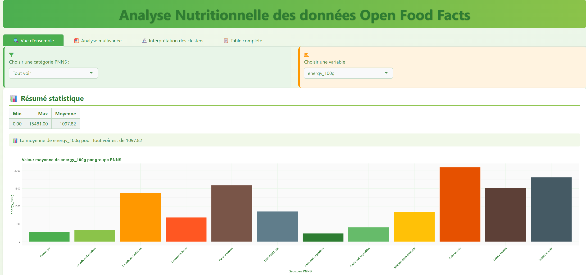
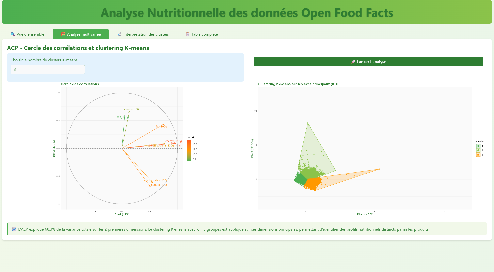

# 🥗 Analyse Nutritionnelle — Open Food Facts (R Shiny)

Application interactive développée avec **R Shiny** pour explorer et analyser les données nutritionnelles issues de la base Open Food Facts.

---

## 📸 Aperçu

### Vue d'ensemble — Statistiques par groupe PNNS


### Analyse multivariée — ACP & Clustering K-means


---

## 🚀 Fonctionnalités

- **Vue d'ensemble** : visualisation de la valeur moyenne d'une variable nutritionnelle (énergie, lipides, glucides…) par groupe PNNS, avec résumé statistique (min, max, moyenne)
- **Analyse multivariée** : ACP (Analyse en Composantes Principales) avec cercle des corrélations et clustering K-means configurable
- **Interprétation des clusters** : profils nutritionnels distincts identifiés automatiquement
- **Table complète** : consultation des données brutes filtrées

---

## 📁 Structure du projet
```
├── app.R                  # Application R Shiny principale
├── nettoyage_data.csv     # Données nettoyées (Open Food Facts)
├── assets/
│   ├── R_Nutrition_1.png
│   └── R_Nutrition_2.png
└── README.md
```

---

## ⚙️ Installation & lancement

### Prérequis

- R (>= 4.0)
- Les packages suivants :
```r
install.packages(c("shiny", "ggplot2", "dplyr", "FactoMineR", "factoextra", "cluster"))
```

### Lancer l'application
```r
shiny::runApp("app.R")
```

Ou depuis RStudio : ouvrir `app.R` et cliquer sur **Run App**.

---

## 📊 Données

Le fichier `nettoyage_data.csv` est issu du nettoyage de la base [Open Food Facts](https://world.openfoodfacts.org/), une base de données collaborative et open source sur la composition nutritionnelle des aliments.

Les variables utilisées incluent notamment :
- `energy_100g`, `fat_100g`, `proteins_100g`, `carbohydrates_100g`, `sugars_100g`, `salt_100g`
- `pnns_groups_1` : groupe alimentaire PNNS (Programme National Nutrition Santé)

---

## 🔍 Méthodologie

- **ACP** : réduit la dimensionnalité des données nutritionnelles — les 2 premières dimensions expliquent **68,3 %** de la variance totale
- **K-means** : segmente les produits en K groupes (configurable) sur les axes principaux de l'ACP, permettant d'identifier des profils nutritionnels distincts

---

## 👤 Auteur

**Nathan Chan** — [GitHub](https://github.com/NathanChan1710)
